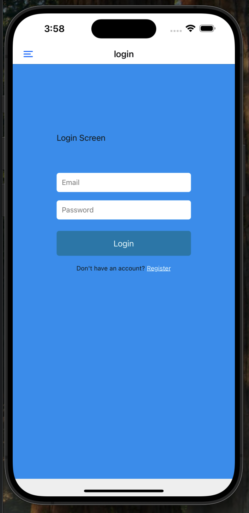
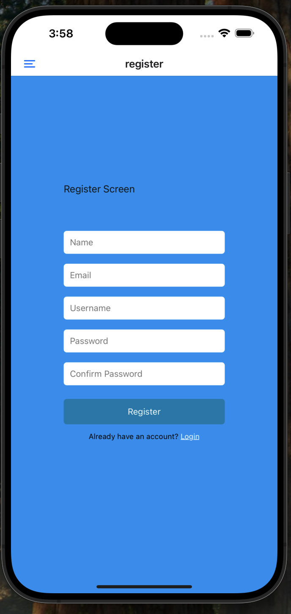
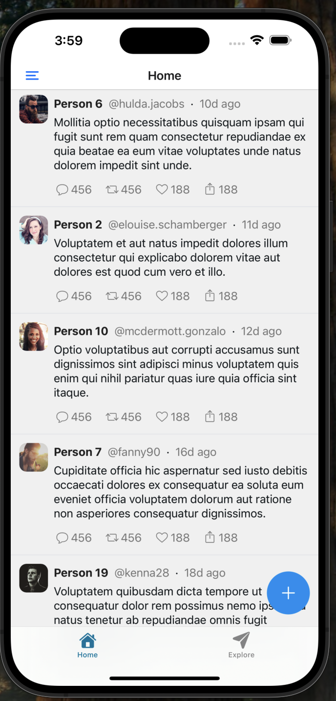
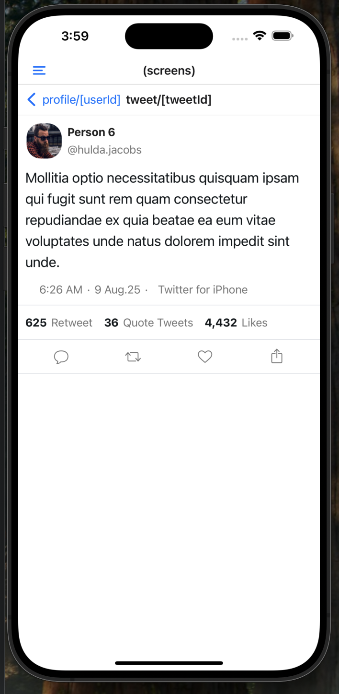
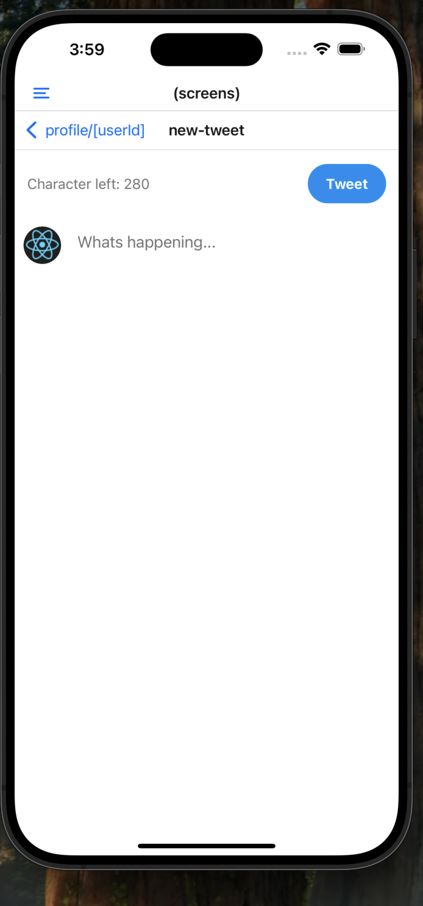
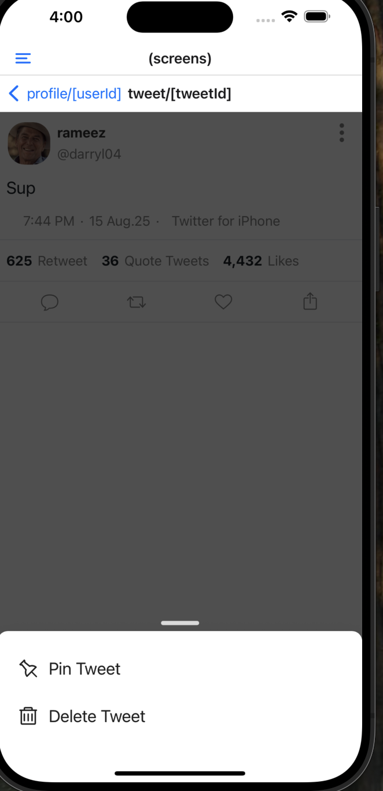
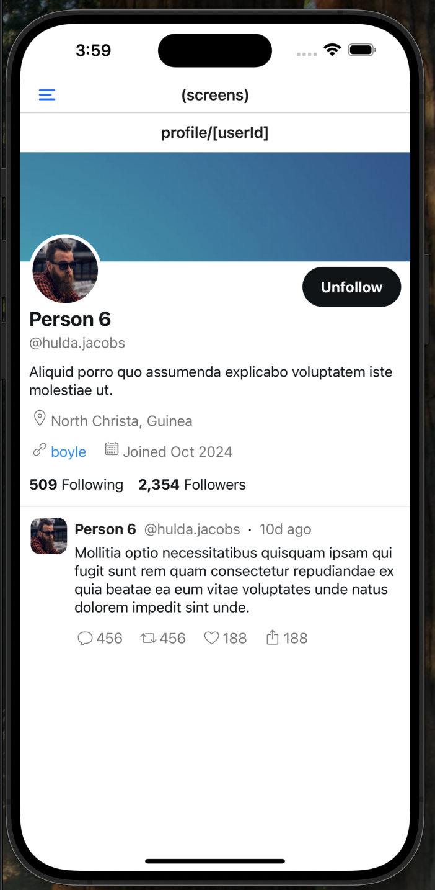

# Twitter X Mobile Clone

A mobile-first Twitter-like social media app built with React Native and Expo. This project offers a polished, high-fidelity Twitter experience for mobile devices, including all the core features you'd expect: registration, login, browsing the tweet feed, tweet details, engagement actions, and user account operations.

---

## Screenshots

<p align="center">
  
  
  
  
  
  
  
</p>


*Sample screenshots: Log in screen, registration, tweet timeline, tweet details, and the new tweet composer.*

---

## What Does This Project Do?

- **Twitter Feed Experience:** View, like, retweet, reply, and share posts in a familiar Twitter timeline.
- **Tweet Details:** See tweet content, author profile, interaction counts (likes, retweets, quotes), detailed timestamps, and more.
- **User Authentication:** Secure registration and login with JWT token storage. The app keeps users logged in securely via encrypted storage.
- **User Actions:** Authenticated users can write, delete, and pin their tweets (actions such as deleting a tweet require confirmation).
- **Navigation:** Smooth screen transitions thanks to Expo Router and modern React patterns.
- **Mobile Ready:** Fully responsive for iOS and Android using React Native's core components and Expo's enhancement libraries.

---

## Technology Stack

- **Frontend:**
    - [React Native](https://reactnative.dev/) with [Expo](https://expo.dev/)
    - [TypeScript](https://www.typescriptlang.org/)
    - [React Navigation / Expo Router](https://expo.github.io/router/docs/)
    - [Axios](https://axios-http.com/) for API requests
    - [SecureStore (Expo)](https://docs.expo.dev/versions/latest/sdk/securestore/) for securely storing user tokens and session
    - [Date-fns](https://date-fns.org/) for date handling
    - [React Native Modalize](https://jeremybarbet.github.io/react-native-modalize/) for action sheets/modals
    - Modern UI idioms and component structure

- **Backend:**
    - See [alpharameeztech/laravel-x-tweet-backend](https://github.com/alpharameeztech/laravel-x-tweet-backend) (Laravel + JWT Auth)  
      This app requires the above Laravel API server running for signup, login, and tweet interactions.

---

## Features

- **Authentication:**  
  Users can register with name, email, username, and password. Returning users can log in; secure authentication tokens are safely stored and used for all requests.

- **Tweet Timeline:**  
  Browse a timeline/feed of tweets, see tweet details, view profiles.

- **CRUD Operations:**  
  Authenticated users can create, delete, and pin tweets. Confirmation dialogs are used to avoid accidental destructive actions.

- **Responsive Layout:**  
  Works great on both iOS and Android devices.

- **Engagement Actions:**  
  Like, retweet, quote, and reply just like on Twitter.

---

## Getting Started

1. **Install Dependencies**

    ```bash
    yarn install
    # or
    npm install
    ```

2. **Run the App**

    ```bash
    npx expo start
    ```

3. **Set up the Backend**

   Make sure to follow backend installation steps at [laravel-x-tweet-backend](https://github.com/alpharameeztech/laravel-x-tweet-backend) and set API URL in the frontend as necessary.

---

## Learn More

- [Expo Documentation](https://docs.expo.dev/)
- [React Native Documentation](https://reactnative.dev/)
- [Full Backend Repo & API Docs](https://github.com/alpharameeztech/laravel-x-tweet-backend)